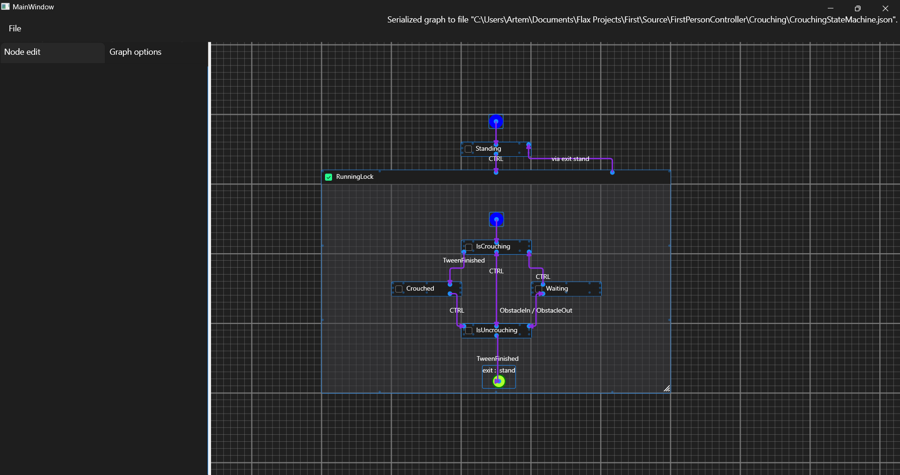

The full documentation is here: https://artempindrus.github.io/StateGrapher/docs/introduction.html.

# Introduction
StateGrapher is a tool used to graph Hierarchical State Machines. Based on the graphs, C# state-machine classes are generated.

Based on the graphs, C# state-machine classes are generated.

Made with WPF with a great contribution of [nodify](https://github.com/miroiu/nodify).

## Generated State Machine
General structure of generated class is inspired by what [StateSmith](https://github.com/StateSmith/StateSmith) does.
The main difference is that the graph itself DOESN'T contain ANY code logic, only states and transitions.
The generated class will have a bunch of partial methods without definition that can be defined to provide actual logic.
