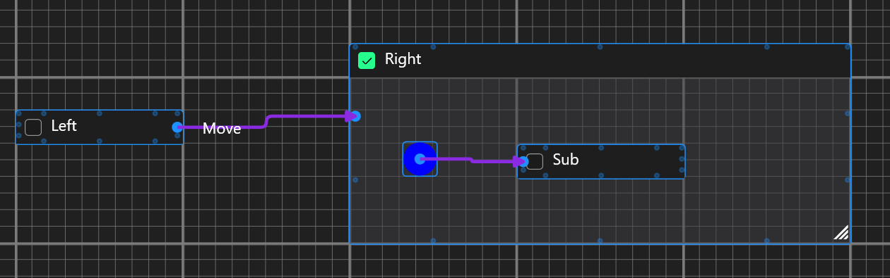
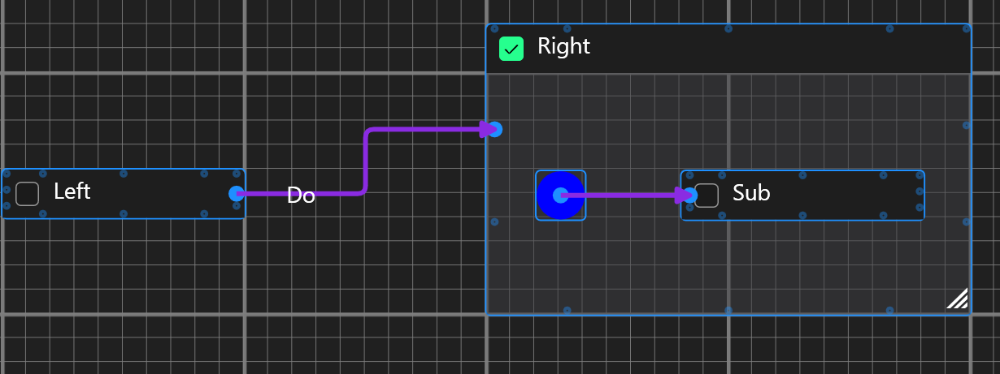
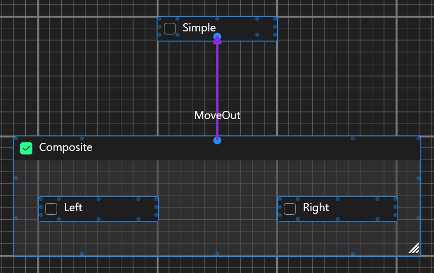
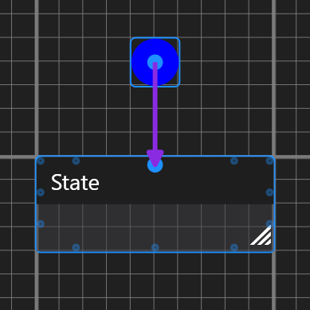
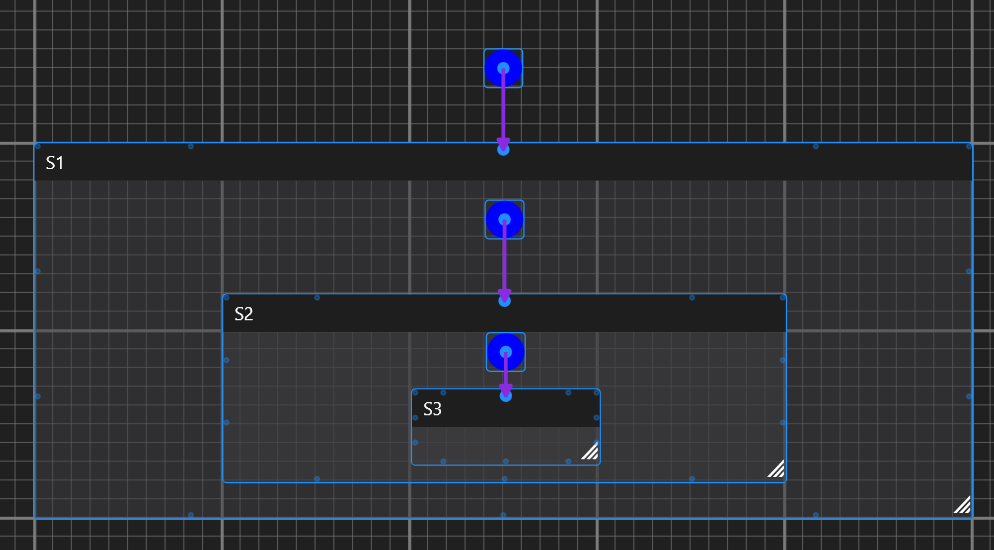

# StateGrapher
THIS TOOL IS USEABLE BUT NOT STABLE!

Almost every version  introduces breaking/design changes.

## Description
This is a tool used to graph Hierarchical State Machines.
Based on the graphs, C# state-machine classes are generated.

Made with WPF with a great contribution of [nodify](https://github.com/miroiu/nodify).

## Generated State Machine
General structure of generated class is inspired by what [StateSmith](https://github.com/StateSmith/StateSmith) does.
The main difference is that the graph itself DOESN'T contain ANY code logic, only states and transitions.
The generated class will have a bunch of partial methods without definition that can be defined to provide actual logic.

## Terminology
### Connection
A connection between nodes in graph.

#### Two-way connections
TODO

### Transition
Change of one state to the other due to an event.

#### Initial transition
Initial transition describes a transition from a state to an Initial State of a State Machine.

(Transition "Left" to "Sub" through "Move")

Requires: 
- Connection from a State to a State Machine (SM).
- An Initial State node (I) in SM.
- Connection of I to a Sub-state of SM.

#### Exit transition
TODO

### Connection VS Transition 
Connection is visual. It's what's being created in the graph. It doesn't *necessary* reflect transition.

Let's look at some examples.

Here, the "Do" connection connects "Left" state with "Right" state, but the state machine generator recognizes it as a transition from "Left" to "Sub" through "Do".

Here, the "MoveOut" connection connects "Composite" to "Simple", but the state machine generator recognizes:
- Transition from "Left" to "Simple" through "MoveOut", and
- Transition from "Right" to "Simple" through "MoveOut"

### State
State types:
- Simple state - state without sub-states.
- State Machine (Composite state) - a state containing other states.

#### Initial state
State to which InitialState node connects.

When entering a Compound state this will be THE state that gets entered eventually.

Here Initial state of Root is "State".

Here entering Root results in:
- Enter S1
- Enter S2
- Enter S3
 

