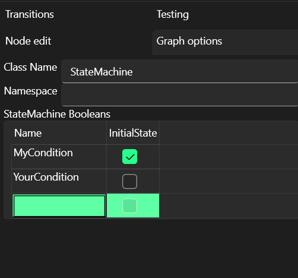

# Graph options
Graph options can be accessed in the left side-panel.

## Class name and Namespace
Those specify name and namespace of the generated class.

## StateMachine booleans
StateMachine booleans are utilized in multiple places across the graph (especially [Connections conditions](connections.md#conditions)).

At code level those represent public boolean fields on the generated class.

"Initial state" describes whether the field is true or false at the construction time.
