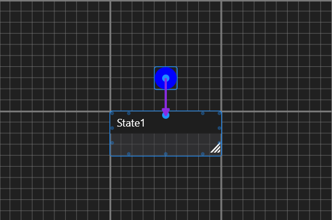

# Nodes
Nodes are elements of the State Machine Graph.

## Initial State
Every Composite state can have at most one Initial State node (and, in fact, SHOULD have an InitialState node)

Initial State connects to a state that should be entered when entering a Composite state.

### Examples
Here the Root of the graph contains State1 and an Initial State node connecting to it, which signifies that when Root is entered, State1 will be entered.

Here entering Root will:
- Enter S1
- Enter S2
- Enter S3

in succession.

