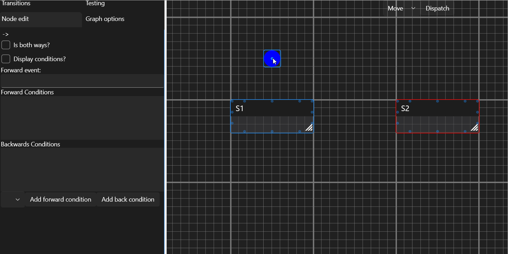

# Transitions
Transition is a change from one state to the other.

They're triggered by specific events.

## Creating transitions
Here you can see:
- creation of a connection between an InitialState node and S1 state
- creation of a connection between S1 and S2 states

Technically the only transition in here is S1 > S2.